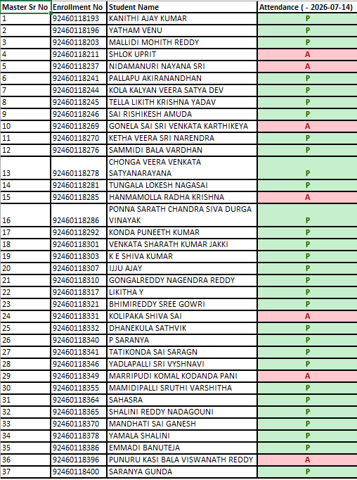

# 🎓 Student Attendance Management System

A responsive **Student Attendance Management System** built using **HTML, CSS, and JavaScript**. This web application allows teachers to efficiently manage student attendance, filter students by lab batches, track attendance in real time, and export attendance records to Excel.

---

## 📖 Project Overview

The Student Attendance Management System is a lightweight web application designed to simplify the attendance-taking process in classrooms and laboratories. It provides an intuitive interface for marking attendance, viewing attendance statistics, filtering students by lab groups, and exporting attendance data for record keeping.

This project uses the browser's **Local Storage** to save attendance records, ensuring that data is retained even after refreshing the page.

---

## ✨ Features

- ✅ Responsive and user-friendly interface
- ✅ Mark students as **Present (P)** or **Absent (A)**
- ✅ Toggle attendance with a single click
- ✅ Real-time Present and Absent counters
- ✅ Mark all students as Present
- ✅ Mark all students as Absent
- ✅ Filter students by:
  - All Students
  - Lab A
  - Lab B
- ✅ Subject selection
- ✅ Date selection
- ✅ Attendance data saved using Local Storage
- ✅ Export attendance to Excel (.xls)
- ✅ Professional dashboard design

---

## 🛠 Technologies Used

- HTML5
- CSS3
- JavaScript (ES6)
- Local Storage API
- Microsoft Excel Export (.xls)

---

## 📂 Project Structure

```
Student-Attendance-Management-System/
│
├── index.html
├── Attendance Marked.png
├── Excel.png
├── Home Page1.png
├── Home Page2.png
├── Home Page3.png
├── Lab A filter.png
├── Lab B filter.png
└── README.md
```

---

## 📸 Project Screenshots

### 🏠 Home Page


---

### 📊 Dashboard


---

### 📋 Attendance Sheet


---

### 🧪 Lab A Filter


---

### 🧪 Lab B Filter


---

### ✅ Attendance Marked


---

### 📈 Excel Export



---

## 🚀 How to Run

1. Download or clone this repository.

```
git clone https://github.com/sharathjakki1316/Student-Attendance-Management-System.git
```

2. Open the project folder.

3. Double-click **index.html**

OR

Open **index.html** in any modern web browser.

No installation or additional software is required.

---

## 💻 How It Works

1. Select the attendance date.
2. Choose the subject.
3. Mark each student's attendance.
4. Filter students by Lab A or Lab B if required.
5. View the Present and Absent counts.
6. Export attendance to an Excel file.

---

## 🎯 Learning Outcomes

Through this project, I learned:

- HTML page structure
- CSS styling and responsive layouts
- JavaScript DOM manipulation
- Event handling
- Local Storage API
- Dynamic table generation
- Excel file export
- User interface design

---

## 🔮 Future Improvements

- Login authentication
- Student search functionality
- Monthly attendance reports
- PDF export
- Database integration (MySQL)
- Firebase cloud storage
- Attendance percentage calculation
- QR Code attendance
- Dark mode

---

## 👨‍💻 Author

**VENKATA SHARATH KUMAR JAKKI**

GitHub:
https://github.com/sharathjakki1316

LinkedIn:
https://www.linkedin.com/in/venkata-sharath-kumar-jakki-536947329/?lipi=urn%3Ali%3Apage%3Ad_flagship3_profile_view_base_contact_details%3BmIWy1E%2FPRjOu70ry1tQNpg%3D%3D

---

## ⭐ Support

If you found this project useful, please consider giving it a ⭐ on GitHub.

Thank you for visiting this repository!

---
